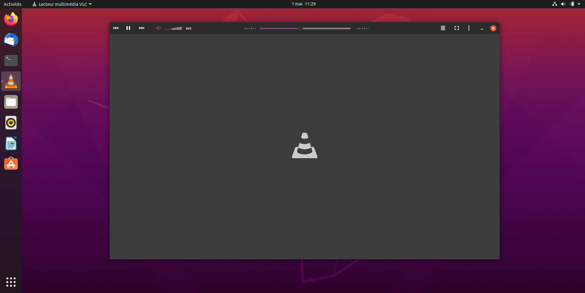

# VLC Yaru Dark

A VLC media player Skin for Ubuntu 20.04 with [Yaru theme](https://github.com/ubuntu/yaru). The skin is based on [GNOME-style client-side decorations (CSD) initiative](https://wiki.gnome.org/Initiatives/CSD).

Most of the icons are reused from [VLC-Arc-Dark](https://github.com/varlesh/VLC-Arc-Dark)

## Install
* Download the file [YaruDark.vlt](https://gitlab.com/NovaQC/vlc-yaru-dark/-/raw/master/YaruDark.vlt?inline=false)
* Open VLC and go to preference > Interface > Choose Skin. Select YaruDark.vlt
* Restart VLC.

## License
GPL 3

## How to contribute
* [Download VLC media player Skin Editor](https://www.videolan.org/vlc/skineditor.html)
* Open YaruSkin.xml
* Make sure to have the Skin.dtdt in the same folder

