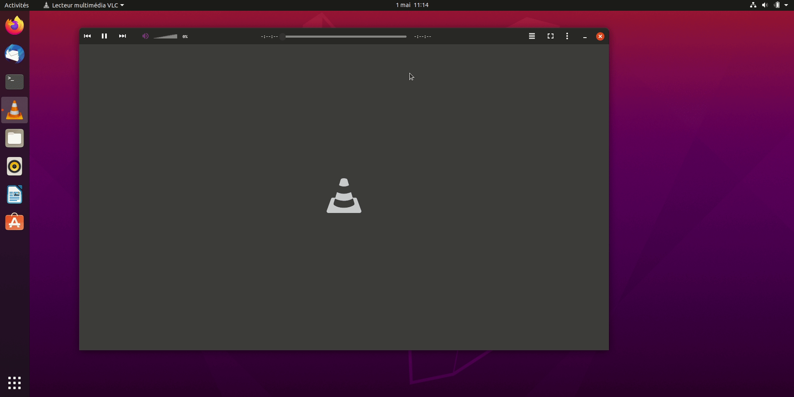

# VLC Yaru Dark

A VLC media player Skin with [Yaru theme](https://github.com/ubuntu/yaru). The skin is based on [GNOME-style client-side decorations (CSD) initiative](https://wiki.gnome.org/Initiatives/CSD).

There are 3 differents variant of the skin:

* **[VLC Yaru Dark (Official)](https://gitlab.com/NovaQC/vlc-yaru-dark/-/blob/master/YaruDark.vlt)**
* *[VLC Yaru Dark with the maximise button - Ubuntu 18.04 style (experimental)](https://gitlab.com/NovaQC/vlc-yaru-dark/-/blob/master/YaruDarkMax_18-04.vlt)*
* *[VLC Yaru Dark with the maximise button - Ubuntu 20.04 style (experimental)](https://gitlab.com/NovaQC/vlc-yaru-dark/-/blob/master/YaruDarkMax_20-04.vlt)*

Current version: **2.0 (2020/05/01)**

The skin was tested on : 

* VLC 3.0
* Ubuntu 22.04 / Arch Linux
* resolution of 1920 X 1080

## Install
* Download the file [YaruDark.vlt](https://gitlab.com/NovaQC/vlc-yaru-dark/-/raw/master/YaruDark.vlt?inline=false)
* Open VLC and go to preference > Interface > Choose Skin. Select YaruDark.vlt
* Restart VLC.

## Approach of the project and next steps:
NovaQC Involve [/r/Ubuntu](https://www.reddit.com/r/Ubuntu/) reddit community at each step of the design.

Based on NovaQC's post of [April 10th](https://www.reddit.com/r/Ubuntu/comments/fyk9uj/my_vlc_yaru_dark_skin_is_ready_to_download_link/), here are the main features NovaQC will try to add for the next release:

- [x] Make the skin resizable (with a maximize button);
- [x] Add Volume button and slider;
- [x] Add more function on the fullscreen;
- [ ] Package the skin in .deb to push the update more easily.

### How to contribute
* [Download VLC media player Skin Editor](https://www.videolan.org/vlc/skineditor.html)
* Open YaruSkin.xml
* Make sure to have the Skin.dtd in the same folder

### License
GPL 3

### Attribution
This project is fork [VLC-Yaru-Dark](https://gitlab.com/NovaQC/vlc-yaru-dark). Most of the icons are reused from [VLC-Arc-Dark](https://github.com/varlesh/VLC-Arc-Dark) and [VLC Deep Dark](https://addons.videolan.org/p/1008199/).
